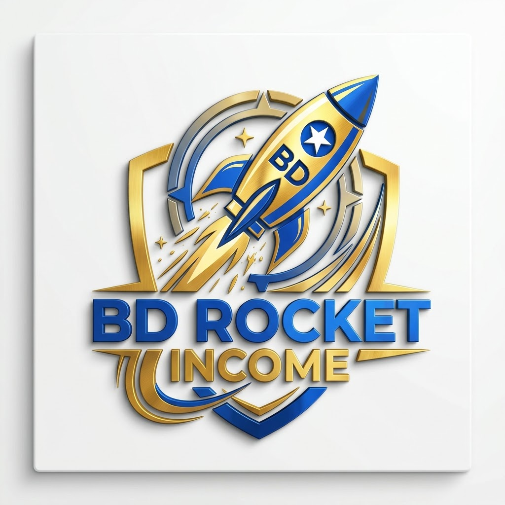

# BD Rocket Income — Setup গাইড

## এই প্রজেক্টে কী কী আছে
- `index.html` — লগইন/সাইনআপ (রেফারেল কোড সাপোর্ট সহ)
- `activate.html` — ৳50 bKash একটিভেশন ফি + Transaction ID সাবমিশন
- `dashboard.html` — হোম, ব্যালেন্স, টাস্ক গ্রিড
- `tasks.html` — Ad ভিউ / সার্ভে / মাইক্রো জব সাবমিশন
- `refer.html` — রেফার লিংক ও টিম লিস্ট
- `wallet.html` — উইথড্র (মিনিমাম ৳150, ১০% ফি)
- `admin.html` — অ্যাডমিন প্যানেল (হিডেন URL, `/admins` কালেকশনে UID না থাকলে ঢুকতে পারবে না)
- `firestore.rules` — সিকিউরিটি রুলস (খুবই গুরুত্বপূর্ণ, স্কিপ করবেন না)

## ধাপ ১: Firebase প্রজেক্ট তৈরি
1. https://console.firebase.google.com এ যান → "Add project" → নাম দিন (যেমন `bd-rocket-income`)
2. প্রজেক্টের ভিতরে **Build → Authentication → Get started → Email/Password** চালু করুন
3. **Build → Firestore Database → Create database → Production mode**
4. **Project settings (⚙️) → General → Your apps → Web (</>) আইকনে ক্লিক করে একটা Web App যোগ করুন**
5. যে `firebaseConfig` অবজেক্ট দেখাবে সেটা কপি করে `js/firebase-config.js` ফাইলে বসান

## ধাপ ২: Firestore Rules বসান
1. Firebase Console → Firestore Database → Rules ট্যাব
2. `firestore.rules` ফাইলের পুরো কনটেন্ট পেস্ট করে Publish করুন

## ধাপ ৩: নিজেকে Admin বানান
1. প্রথমে `index.html` দিয়ে normal signup করুন (নিজের ইমেইল দিয়ে)
2. Firebase Console → Authentication ট্যাবে গিয়ে আপনার UID কপি করুন
3. Firestore Database → Data ট্যাব → "Start collection" → নাম দিন `admins`
4. Document ID হিসেবে আপনার UID পেস্ট করুন, একটা ফিল্ড `role: "admin"` দিয়ে সেভ করুন
5. এখন `admin.html` এ ওই ইমেইল/পাসওয়ার্ড দিয়ে লগইন করলে অ্যাডমিন প্যানেল খুলবে

## ধাপ ৪: bKash QR ও নম্বর বসান
`activate.html` ফাইলে খুঁজুন:
```

<div class="merchant-num">01XXXXXXXXX</div>
```
এখানে আপনার আসল bKash merchant QR কোড ছবি ও নম্বর বসান।

## ধাপ ৫: রেট সেট করুন
Admin panel → Rates ট্যাব থেকে Ad ভিউ, সার্ভে, মাইক্রো জব, রেফারেল বোনাসের রেট বসান।
এটা না করলে সব টাস্কের রেট ৳0 দেখাবে।

## ধাপ ৬: Vercel এ ডিপ্লয়
1. এই পুরো ফোল্ডারটা GitHub এ একটা নতুন রিপোজিটরিতে push করুন
2. https://vercel.com → New Project → আপনার GitHub রিপো সিলেক্ট করুন
3. Framework: "Other" সিলেক্ট করুন (এটা static HTML সাইট, কোনো বিল্ড স্টেপ লাগবে না)
4. Deploy চাপুন — কিছুক্ষণেই লাইভ লিংক পাবেন

## যেভাবে পুরো ফ্লো কাজ করে
1. ইউজার সাইনআপ করে → `activationStatus: "unpaid"`
2. `activate.html` এ bKash পেমেন্ট করে Transaction ID দেয় → status হয় `"pending"`
3. Admin panel এ গিয়ে আপনি bKash অ্যাপে টাকা এসেছে কিনা ম্যানুয়ালি চেক করেন
4. মিলে গেলে "Approve" চাপেন → status হয় `"approved"` → ইউজার dashboard এ ঢুকতে পারে
5. ইউজার টাস্ক সাবমিট করে → Admin panel এ "pending submissions" এ দেখা যায়
6. Admin approve করলেই ব্যালেন্সে টাকা যোগ হয় (কোডেই অটোমেটিক ক্যালকুলেট হয়)
7. ইউজার উইথড্র রিকোয়েস্ট করে → Admin ম্যানুয়ালি bKash/Nagad এ টাকা পাঠিয়ে "Paid & Approve" চাপে

## ⚠️ গুরুত্বপূর্ণ পরামর্শ (আইনি ও ব্যবসায়িক)
- বাংলাদেশে টাকা লেনদেন করা প্ল্যাটফর্ম চালাতে **Trade License** নেওয়া উচিত — এতে ইউজারদের আস্থা বাড়ে এবং bKash/Nagad যদি হঠাৎ আপনার নম্বর ফ্ল্যাগ করে (অনেক ছোট-বড় লেনদেনের কারণে প্রায়ই হয়), তখন সমস্যা কম হয়
- ইউজারের কাছে **কখনো** তাদের নিজস্ব সোশ্যাল মিডিয়া (Facebook/Gmail/Instagram) পাসওয়ার্ড, cookies, বা 2FA key চাইবেন না — এটা আইনত credential theft হিসেবে গণ্য হতে পারে এবং আপনার ব্যবসার জন্যও বড় ঝুঁকি
- উইথড্র রিকোয়েস্ট যত দ্রুত সম্ভব process করুন — এই ধরনের সাইটে ইউজারদের সবচেয়ে বড় অভিযোগ থাকে "টাকা তুলতে পারছি না", তাই সময়মতো পেমেন্ট পাঠানো আপনার সাইটের বিশ্বাসযোগ্যতা তৈরি করবে
